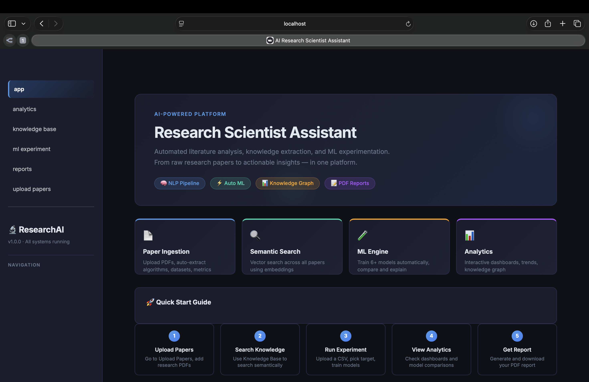
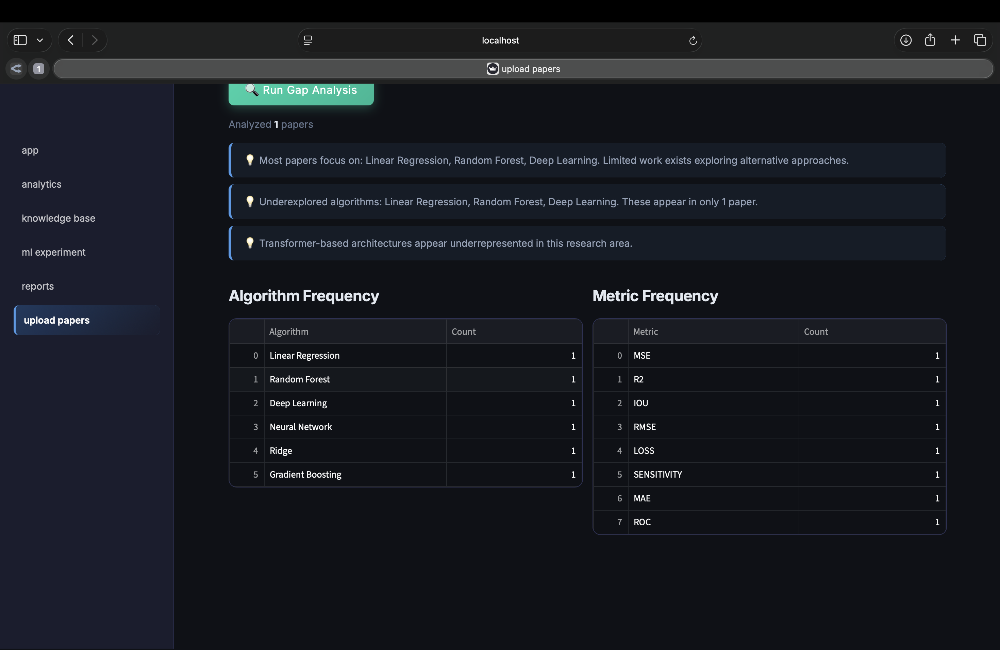
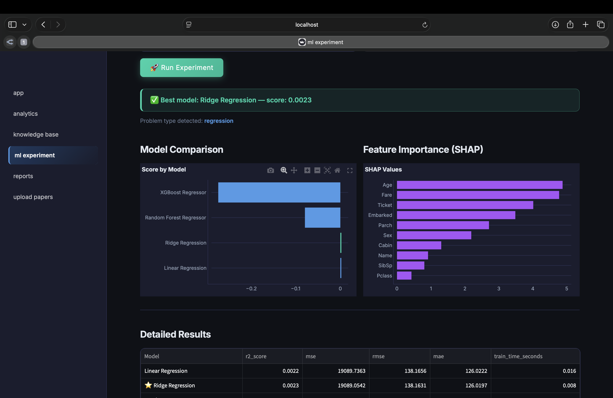
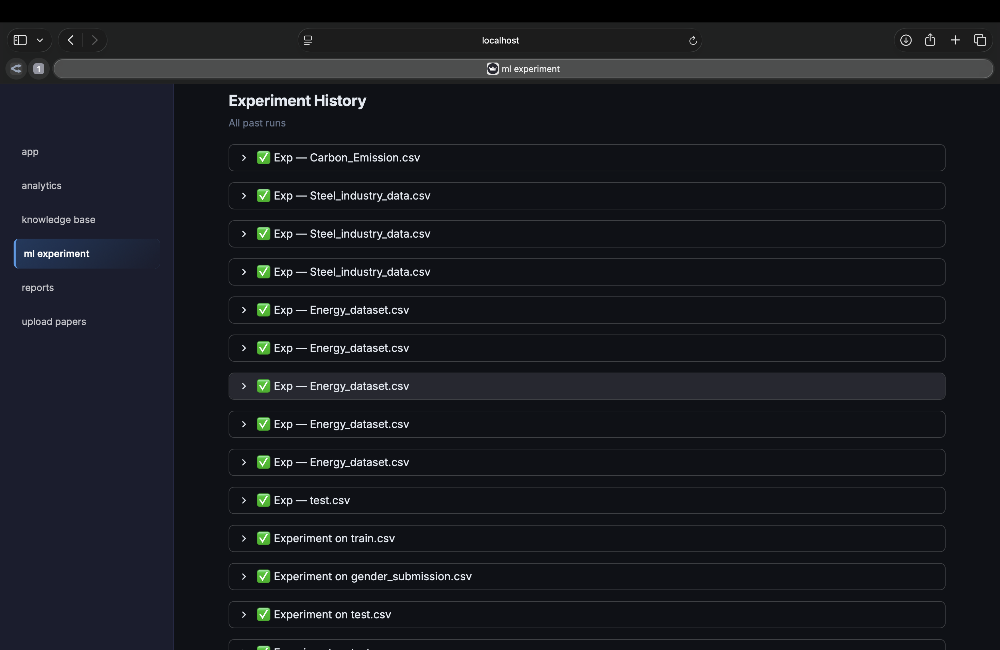
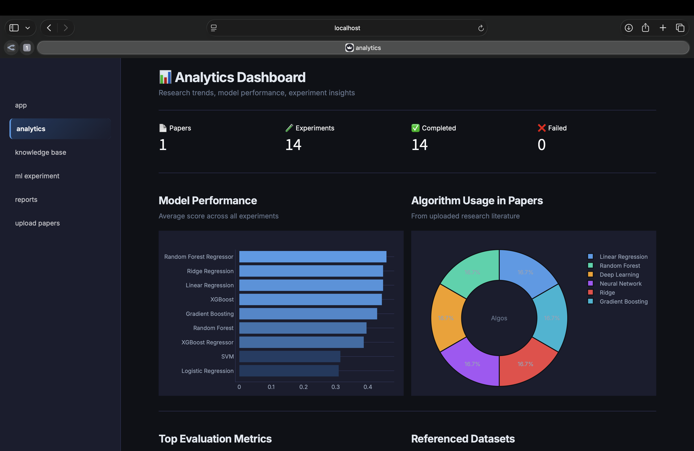
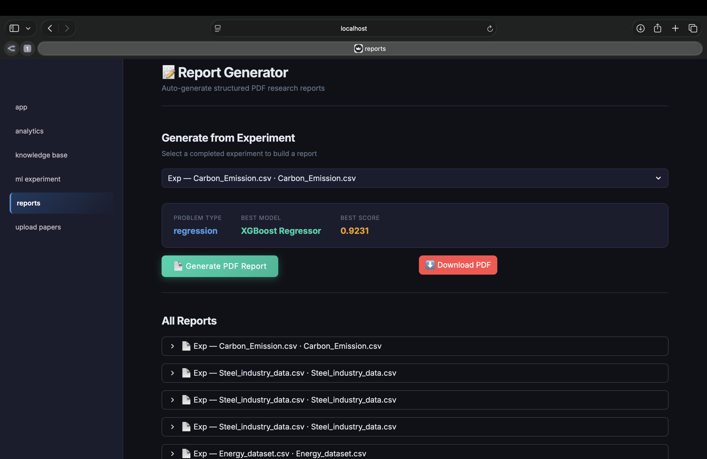

<div align="center">

<br/>


<br/><br/>

# 🔬 AI Research Scientist Assistant

### Automated Literature Analysis & ML Experimentation Platform

**An end-to-end AI platform that automates research paper analysis, knowledge extraction, and ML experimentation.**  
Built for researchers, data scientists, and ML engineers who want to move faster from raw literature to actionable insights.

<br/>

[](https://github.com/charanpreetSingh123/research-scientist-assistant)
&nbsp;
[](http://localhost:8000/docs)

<br/>

</div>

---

## 📋 Features at a Glance

| Module | What it does |
|---|---|
| 📄 **Paper Ingestion** | Upload research PDFs — auto-extracts title, authors, algorithms, datasets, and metrics |
| 🔍 **Semantic Search** | Search across all papers using vector embeddings via ChromaDB |
| 🕸️ **Knowledge Graph** | Visual graph of relationships between papers, algorithms, datasets, and authors |
| 🔎 **Gap Detection** | Automatically identifies underexplored algorithms and missing research directions |
| 🧪 **ML Engine** | Auto-profiles datasets, trains 6+ models, selects the best one automatically |
| 🧠 **Deep Learning** | PyTorch feed-forward network for tabular data |
| 💡 **Explainability** | SHAP-based feature importance and model interpretation |
| 📝 **Report Generator** | Auto-generates structured PDF research reports |
| 📊 **Analytics Dashboard** | Interactive Plotly charts for trends, model comparison, and experiment history |

---

## 🛠️ Tech Stack

```
┌──────────────────┬───────────────────────────────────────────────────────────┐
│  Layer           │  Tools                                                    │
├──────────────────┼───────────────────────────────────────────────────────────┤
│  Frontend        │  Streamlit                                                │
│  Backend         │  FastAPI · Python 3.13                                    │
│  Machine Learning│  Scikit-learn · XGBoost · PyTorch                        │
│  NLP / Embeddings│  Sentence Transformers (all-MiniLM-L6-v2)                │
│  Vector Database │  ChromaDB                                                 │
│  Relational DB   │  PostgreSQL                                               │
│  Explainability  │  SHAP                                                     │
│  Knowledge Graph │  NetworkX · Plotly                                        │
│  PDF Processing  │  PyMuPDF · pdfplumber · ReportLab                        │
│  Infrastructure  │  Docker · Docker Compose                                  │
└──────────────────┴───────────────────────────────────────────────────────────┘
```

---

## 📸 Screenshots

### 🏠 Home Dashboard


### 📄 Upload Papers


### 🧪 ML Experiment Results


### 📈 Experiment History


### 📊 Analytics Dashboard


### 📝 Reports


---

## 🚀 Quick Start

### Prerequisites

- Python 3.10+
- Docker Desktop (running)
- Git

### Setup in 7 steps

**1. Clone the repository**
```bash
git clone https://github.com/charanpreetSingh123/research-scientist-assistant.git
cd research-scientist-assistant
```

**2. Install dependencies**
```bash
pip install -r requirements.txt
```

**3. Set up environment variables**
```bash
cp .env.example .env
```

**4. Start databases via Docker**
```bash
docker-compose up -d
```

**5. Initialize database tables**
```bash
python3 scripts/init_db.py
```

**6. Start the backend**
```bash
uvicorn backend.main:app --reload --port 8000
```

**7. Start the frontend** *(new terminal)*
```bash
streamlit run frontend/app.py
```

Visit **http://localhost:8501** to open the app.

---

## 📂 Project Structure

```
research-scientist-assistant/
│
├── backend/
│   ├── api/
│   │   └── routes/
│   │       ├── papers.py              # Paper upload and gap analysis
│   │       ├── knowledge.py           # Semantic search and graph
│   │       ├── experiments.py         # ML experiment runner
│   │       ├── reports.py             # PDF report generation
│   │       └── analytics.py           # Dashboard data
│   │
│   ├── services/
│   │   ├── research_parser/
│   │   │   ├── pdf_extractor.py       # Raw text extraction from PDF
│   │   │   ├── text_parser.py         # Structure extraction
│   │   │   └── paper_service.py       # Orchestration + DB
│   │   ├── ml_engine/
│   │   │   ├── data_profiler.py       # Dataset analysis
│   │   │   ├── preprocessor.py        # Cleaning + encoding
│   │   │   ├── trainer.py             # Multi-model training
│   │   │   ├── explainer.py           # SHAP analysis
│   │   │   ├── deep_learning.py       # PyTorch network
│   │   │   └── experiment_service.py
│   │   ├── knowledge_graph/
│   │   │   └── graph_service.py       # NetworkX graph builder
│   │   ├── vector_store/
│   │   │   └── embeddings.py          # ChromaDB operations
│   │   └── report_generator/
│   │       └── pdf_report.py          # ReportLab PDF builder
│   │
│   ├── models/
│   │   ├── database.py                # SQLAlchemy engine
│   │   └── schemas.py                 # Table definitions
│   ├── config.py
│   └── main.py
│
├── frontend/
│   ├── pages/
│   │   ├── upload_papers.py
│   │   ├── knowledge_base.py
│   │   ├── ml_experiment.py
│   │   ├── analytics.py
│   │   └── reports.py
│   └── app.py
│
├── tests/
│   ├── test_parser.py
│   ├── test_profiler.py
│   ├── test_preprocessor.py
│   └── test_trainer.py
│
├── scripts/
│   └── init_db.py
│
├── data/
│   ├── sample_datasets/
│   └── sample_papers/
│
├── docker-compose.yml
├── requirements.txt
├── .env.example
└── README.md
```

---

## 🧪 Sample Datasets

Download and place in `data/sample_datasets/`:

| Dataset | Link | Task |
|---|---|---|
| Titanic | [kaggle.com/c/titanic](https://www.kaggle.com/c/titanic) | Classification |
| House Prices | [kaggle.com/c/house-prices](https://www.kaggle.com/c/house-prices-advanced-regression-techniques) | Regression |
| Mall Customers | [kaggle.com/datasets/vjchoudhary7](https://www.kaggle.com/datasets/vjchoudhary7/customer-segmentation-tutorial-in-python) | Clustering |

---

## ✅ Running Tests

```bash
python3 tests/test_parser.py
python3 tests/test_profiler.py
python3 tests/test_preprocessor.py
python3 tests/test_trainer.py
```

All 4 test suites should pass with no errors.

---

## 📌 API Documentation

Once the backend is running, visit:

| Interface | URL |
|---|---|
| **Swagger UI** | http://localhost:8000/docs |
| **ReDoc** | http://localhost:8000/redoc |

---

## 🔖 Versioning

| Version | Description |
|---|---|
| `v1.0.0` | Initial release — full pipeline: paper ingestion → ML experiments → PDF reports |

---

## 🌱 What This Platform Enables

```
✅  Automate research paper ingestion and metadata extraction
✅  Search across your entire literature base semantically
✅  Visualize connections between papers, authors, and algorithms
✅  Identify gaps and unexplored directions in any research domain
✅  Run multi-model ML experiments with auto model selection
✅  Explain model decisions with SHAP feature importance
✅  Generate structured PDF research reports automatically
```

---

## 👤 Author

**Charanpreet Singh**  
B.Tech CSE — CGC University Mohali

[](https://github.com/charanpreetSingh123)

---

<div align="center">

**Built for Researchers · ML Engineers · Data Scientists**

<br/>

*If this project helped you, consider giving it a ⭐ on GitHub!*

</div>
